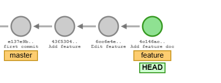
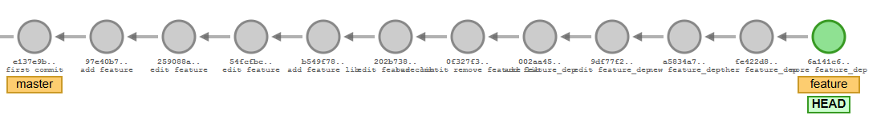

- **base_repo.7z** contiene el repositorio base del apartado `trabajando con ramas`. Si se descarga y descomprime se puede utilizar para los siguientes apartados.


- **base_repo_2.7z** contiene el repositorio básico con dos ramas. Si se descarga y descomprime se puede utilizar para los siguientes apartados.



- **rebase_repo.7z** contiene el repositorio básico para rebase. Si se descarga y descomprime se puede utilizar para los siguientes apartados.



Nota: Ten cuidado con el  editor por defecto incluido en el repositorio. La configuración del editor la puedes cambiar con (dentro del repositorio):
```
git config core.editor code | nano | vim 
```
o
```
git config core.editor "code --wait"
```
o

```
git config --unset core.editor
```
